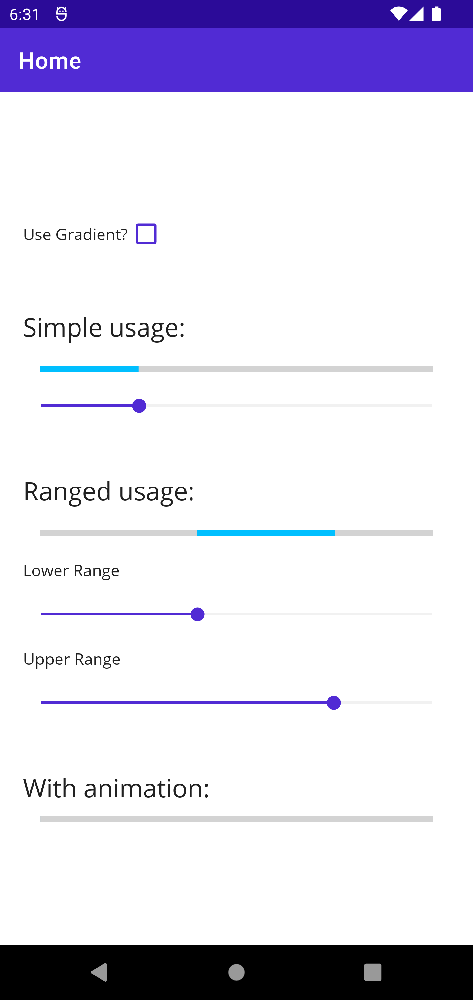
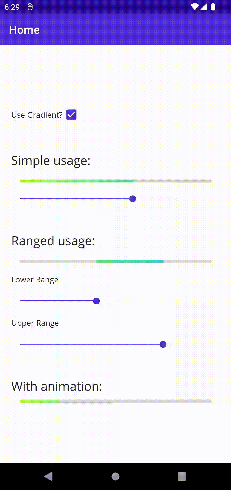

# epj.ProgressBar.Maui

[](https://www.nuget.org/packages/epj.ProgressBar.Maui/)

A customizable Progress Bar supporting Indeterminate states and Progress animations

## Summary

A simple progress bar implementation for MAUI that offers regular linear progress, value range and color gradients. The control was developed using *SkiaSharp*.

## Platforms

Supported are **Android** and **iOS**, other platforms (incl. Windows and MacCatalyst) have not been tested, but may work anyway.

## Highlights

* Linear Progress
* Lower/Upper Progress Range
* Color Gradient

Since the control reacts to value changes (Progress, Ranges, Colors), it can be animated (e.g. for intedeterminate states).

## Preview

This is just a preview, the styling of the control can be customized. The animation is not part of the control.
<div>
    
    
</div>
<br/>

## Usage

**Important: Register Library**

In MauiProgram.cs, add a call to *UseProgressBar()* on the builder object:

```c#
using epj.RadialDial.Maui;

namespace RadialDialSample;

public static class MauiProgram
{
    public static MauiApp CreateMauiApp()
    {
        var builder = MauiApp.CreateBuilder();
        builder
            .UseMauiApp<App>()
            .ConfigureFonts(fonts =>
            {
                fonts.AddFont("OpenSans-Regular.ttf", "OpenSansRegular");
                fonts.AddFont("OpenSans-Semibold.ttf", "OpenSansSemibold");
            })
            .UseProgressBar(); //add this

        return builder.Build();
    }
}

```

**XAML**

```xml
<?xml version="1.0" encoding="utf-8" ?>
<ContentPage xmlns="http://schemas.microsoft.com/dotnet/2021/maui"
             xmlns:x="http://schemas.microsoft.com/winfx/2009/xaml"
             xmlns:maui="clr-namespace:epj.ProgressBar.Maui;assembly=epj.ProgressBar.Maui"
             x:Class="RadialDialSample.MainPage">
  <VerticalStackLayout
    VerticalOptions="Center">

    <maui:ProgressBar
      HeightRequest="5"
      Margin="15,0"
      Progress="0.3"
      UseGradient="True"
      ProgressColor="Blue"
      GradientColor="Red"/>
    
  </VerticalStackLayout>
</ContentPage>
```

## Properties

Most of these properties are bindable for MVVM goodness. If something is missing, please open an issue.

| Type       | Property             | Description                                                             | Default Value |
|------------|----------------------|-------------------------------------------------------------------------|---------------|
| Float      | Progress             | The current value of the progress bar (between 0.0 and 1.0)             | 0.0           |
| Float      | LowerRangeValue      | The start value of the range (when enabled)                             | 0.0           |
| Float      | UpperRangeValue      | The end value of the range (when enabled)                               | 0.0           |
| Boolean    | UseRange             | When enabled, the range values are used instead of Progress             | false         |
| Boolean    | UseGradient          | Whether or not to enable the progress color gradient                    | false         |
| Color      | ProgressColor        | The color of the progress bar                                           | BlueViolet    |
| Color      | GradientColor        | The gradient color which will be used on the lower end when set         | BlueViolet    |
| Color      | BaseColor            | The color for the base of the progress bar                              | LightGray     |


## Tips & Tricks

### Animations ###
If you would like to animate the progress bar, you need to do so yourself: https://learn.microsoft.com/en-us/dotnet/maui/user-interface/animation/custom.
There is a sample implementation for an indeterminate progress animation in the sample code, check it out!

### Size ###
The size (width and height) can simply be set using *WidthRequest* and *HeightRequest*, there is no separate size property in the control.


## Notes
* Uses SkiaSharp for MAUI
